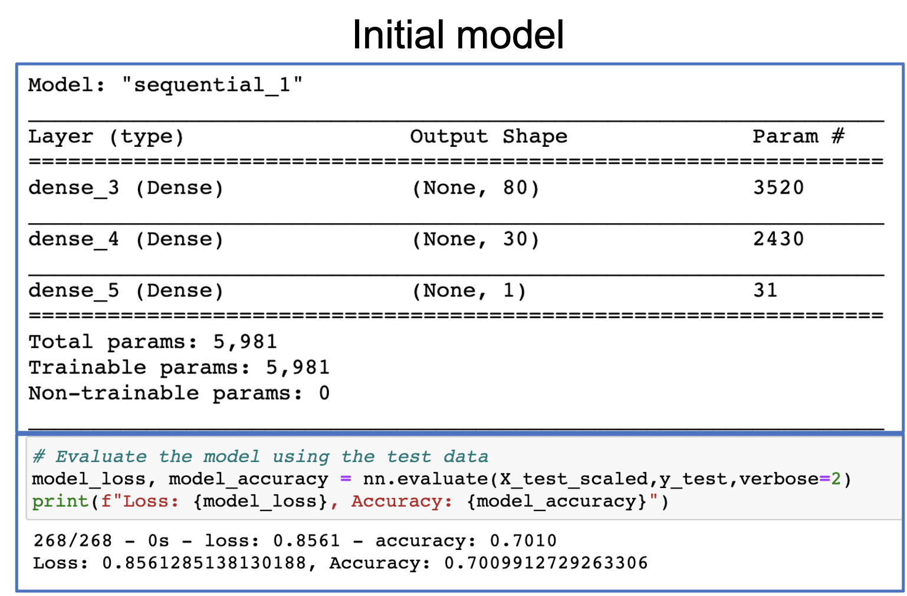
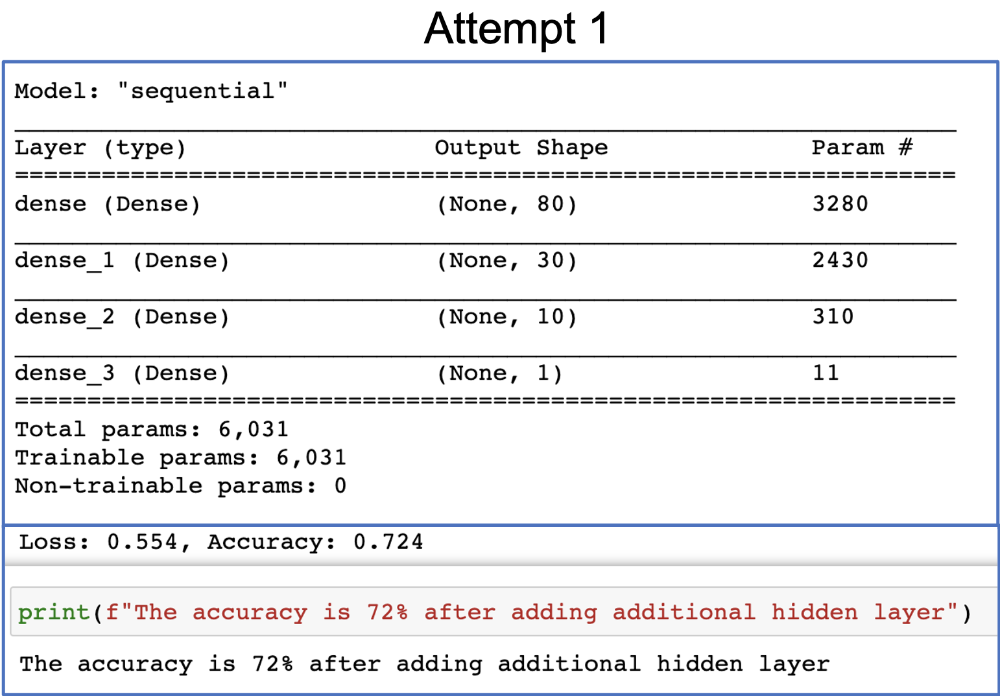
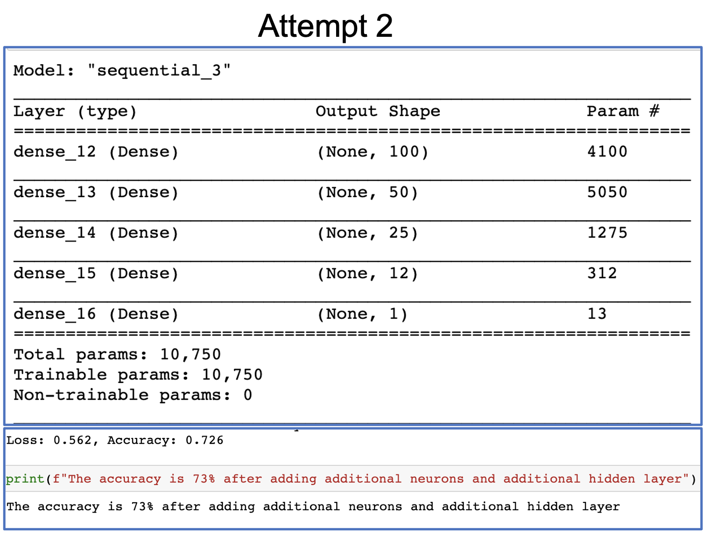
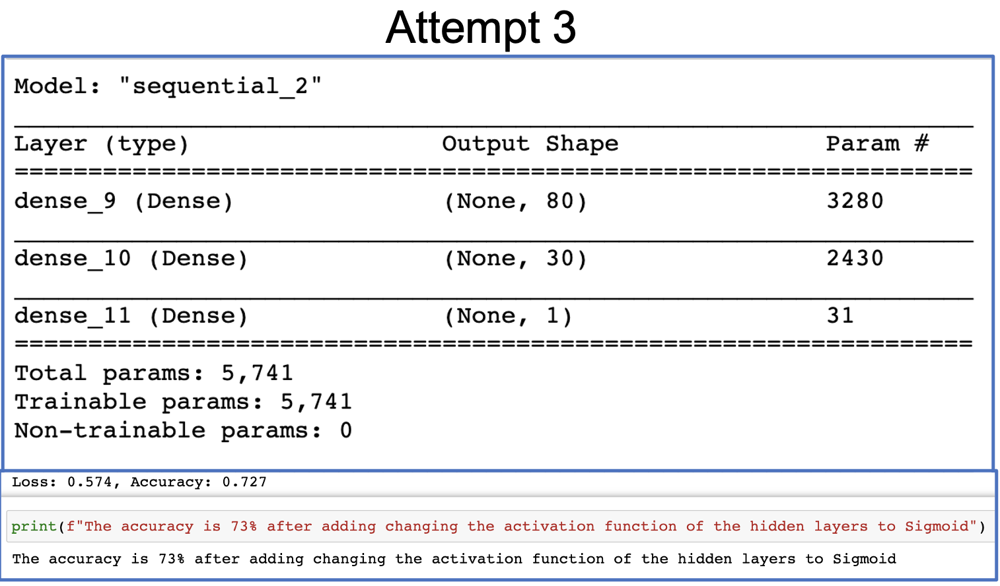
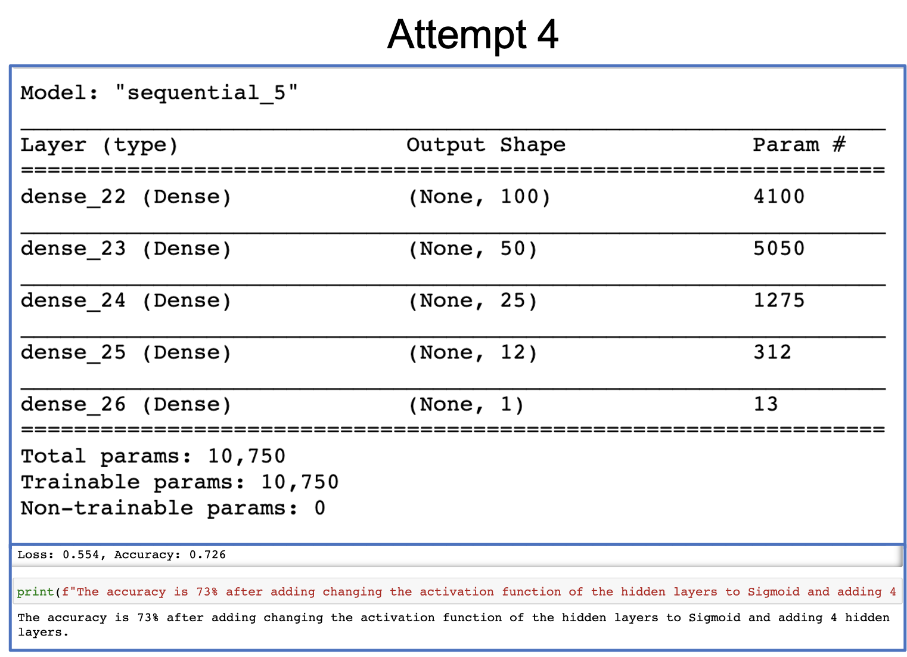

# Neural_Network_Charity_Analysis

## Charity Analysis using Neural Network and Deep Learning.

## Overview of the analysis:

Alphabet Soup is a funding company that has funded more than 34,000 organizations over the years.The purpose of this analysis is to provide insight to the business team of Alphabet Soup, whether applicants will be successful if funded by Alphabet Soup. With  knowledge of machine learning and neural networks, and the features provided in the dataset a binary classifier is created, that is capable of predicting whether applicants will be successful if they get funded.

## Results:

The results are categorized under the following headings:

### Data Preprocessing

The Alphabet Charity Dataset is loaded in the Jupyter notebook and the features are parsed to have a detailed insight into all the features of the dataset.

#### Target Variable:
* From the dataset it is evident that the **target variable** or y is the "**Is Successful**" feature.  
* This is considered as the target variable because we want to analyze if these organizations were successful after being funded by Alphabet Soup.

####  Features of the model:
* After dropping the 'Is successful' feature, as it is the target variable, the other features namely 'Application type', 'Affiliation', 'Classification','Use case', 'Organization', 'Status', 'Income amount','Special considerations' and 'Ask amounts'were considered as the features of the model.

#### Dropped variables:
* Some features in the dataset that didn't add any value to the model were dropped.
* The features that were dropped were 'EIN' and 'NAME.
* Later, in order to increase the efficiency of the model, some more features like 'Status' and 'Special considerations' were also dropped.
* Since, all the rows in the dataset had the same values for status and special considerations, these two features were dropped from the dataset.

### Compiling, Training, and Evaluating the Model

Four attempts were performed in order to increase the performance of the neural network model from 70% 

## Attempt 1:

#### Number of neurons, layers, and activation functions selected for the neural network model:
* The entire length of X trained was used as the input variable, as these are the features of the model.
* The number of hidden layers was increased to **three** hidden layers.
*hidden_nodes_layer1 has  80 neurons.
*hidden_nodes_layer2 has 30 neurons.
*hidden_nodes_layer3 has 10 neurons.
* By increasing the number of hidden layers, the trainable parameters increases(6,031) and it helps to improve the accuracy of the model.
* The activation function that was selected is Rectified Linear Unit or (ReLu). It is the most popular activation function used in neural network.
* Mathematically, it is defined as y = max(0, x)
* ReLu is used as it takes less time to train and run, it converges faster and It’s sparsely activated.

#### Target model performance of 75% and above:
* The performance accuracy increased from 70 % to 72% but failed to reach 75%.
#### Steps to increase model performance:
* Dropped features that didnot add to the value of the model.Features like 'Status' and 'Special considerations' were also dropped in addition to 'Ein' and 'name'.
* Increased the number of hidden layer to three.

## Attempt 2:

#### Number of neurons, layers, and activation functions selected for the neural network model:
* The entire length of X trained was used as the input variable, as these are the features of the model.
* The number of hidden layers was increased to **four** hidden layers.
* Additional neurons are added to hidden layers
*hidden_nodes_layer1 has  100 neurons.
*hidden_nodes_layer2 has 50 neurons.
*hidden_nodes_layer3 has 25 neurons.
*hidden_nodes_layer4 has 12 neurons.
* By increasing the number of hidden layers, the trainable parameters increases(10,750) and it helps to improve the accuracy of the model.
* The activation function that was selected is Rectified Linear Unit or (ReLu). It is the most popular activation function used in neural network.
* Mathematically, it is defined as y = max(0, x)
* ReLu is used as it takes less time to train and run, it converges faster and It’s sparsely activated.

#### Target model performance of 75% and above:
* The performance accuracy incresed from 70 % to 73% but failed to reach 75%.
#### Steps to increase model performance:
* Dropped features that didnot add to the value of the model.Features like 'Status' and 'Special considerations' were also dropped in addition to 'Ein' and 'name'.
* Increased the number of hidden layer to four.
* Additional neurons are added to hidden layers.

## Attempt 3:

#### Number of neurons, layers, and activation functions selected for the neural network model:
* The entire length of X trained was used as the input variable, as these are the features of the model.
* The number of hidden layers was decreased to **two** hidden layers.
*hidden_nodes_layer1 has  80 neurons.
*hidden_nodes_layer2 has 30 neurons.
* The activation function that was selected is Sigmoid. 
* Since, the input values are all binary, I decided to try Sigmoid activation feature.The main reason why we use sigmoid function is because it exists between (0 to 1).

#### Target model performance of 75% and above:
* The performance accuracy increased from 70 % to 73% but failed to reach 75%.
#### Steps to increase model performance:
* Dropped features that didnot add to the value of the model.Features like 'Status' and 'Special considerations' were also dropped in addition to 'Ein' and 'name'.
* Changing the activation function of hidden layers to Sigmoid from ReLu.

## Attempt 4:

#### Number of neurons, layers, and activation functions selected for the neural network model:
* The entire length of X trained was used as the input variable, as these are the features of the model.
* The number of hidden layers was increased to **four** hidden layers.
* Additional neurons are added to hidden layers
*hidden_nodes_layer1 has  100 neurons.
*hidden_nodes_layer2 has 50 neurons.
*hidden_nodes_layer3 has 25 neurons.
*hidden_nodes_layer4 has 12 neurons.
* By increasing the number of hidden layers, the trainable parameters increases(10,750) and it helps to improve the accuracy of the model.
* The activation function that was selected is Sigmoid. 
* Since, the input values are all binary, I decided to try Sigmoid activation feature.The main reason why we use sigmoid function is because it exists between (0 to 1).

#### Target model performance of 75% and above:
* The performance accuracy increased from 70 % to 73% but failed to reach 75%.

#### Steps to increase model performance:
* Dropped features that didnot add to the value of the model.Features like 'Status' and 'Special considerations' were also dropped in addition to 'Ein' and 'name'.
* Increased the number of hidden layer to four.
* Additional neurons are added to hidden layers.
* Changing the activation function of hidden layers to Sigmoid from ReLu.

## Summary:
Initially, the accuracy of the neural network model was found out to be 70%. After multiple attempts and several changes to the dataset and the model, the accuracy went up from 70% to 73%. I was not able to achieve an accuracy of 75% or above. 
* One explanation could be, that with this dataset that is the highest accuracy we can achieve.
* Another way would be to add more meaningful data that would be helpful in training the neural network model.

### Recommendation of another model:
* I would suggest using Random forest classifiers to solve the classification problem.
* The main reason for using Random forest classifiers is because it is a type of ensemble learning model that combines multiple smaller models into a more robust and accurate model.
* It is popular for its robustness and scalability.
* The output is easy to interpret, and it can easily handle outliers and nonlinear data.
* Also, since this dataset is a tabular dataset, I strongly believe Random Forest classifier would be a good choice.

With is above analysis, the Alphabet Soup’s business team will have a clear idea to provide insight to the stakeholders of the foundation, where to make investments in the future.

